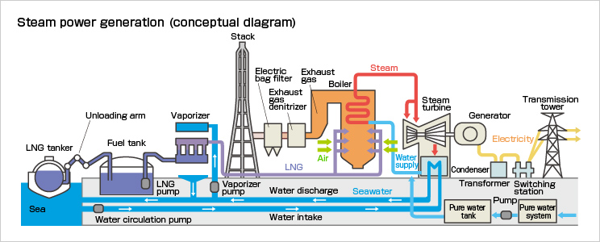

# Industrial Steam Volume Prediction

This project aims to predict industrial steam volume based on boiler sensor data, originally provided as part of a machine learning competition on the Alibaba Tianchi platform.
This is my first machine learning project, focusing on predicting industrial steam volume based on boiler sensor data from the Alibaba Tianchi platform. This project is organized into four main parts, each contained in a Jupyter notebook:

1. **Data Exploration**
2. **Feature Engineering**
3. **Model Predictions**
4. **Model Fusion**

## Project Background

In thermal power generation, steam production is crucial for generating electricity. The basic principle involves burning fuel to heat water, producing high-temperature and high-pressure steam. This steam drives a turbine, which powers an electricity generator. Boiler combustion efficiency is key to overall power generation efficiency. Many factors influence this efficiency, including adjustable boiler parameters and boiler operating conditions.

  

## Problem Description

The dataset includes sensor data from a boiler system, anonymized for privacy. The goal is to predict the amount of steam generated based on the operating conditions of the boiler.

### Data Details

The data is split into:
- **Training Data** (`zhengqi_train.txt`): Contains 38 feature fields (V0-V37) and a target field (steam volume).
- **Testing Data** (`zhengqi_test.txt`): Contains only the feature fields (V0-V37), for which predictions are required.

### Evaluation Metric

The model's performance is evaluated based on **Mean Square Error (MSE)** between the predicted and actual steam volume in the test set.

## Submission Format

Participants are required to submit a text file containing the predicted values for the test data. The file should contain a single column representing the predicted steam volume.

## Getting Started

### Prerequisites

- Python 3.x
- Libraries: `numpy`, `pandas`, `scikit-learn`, `xgboost`, `lightgbm`, `matplotlib`, `scipy`, `seaborn`

## 1-Data Exploration
### Project Overview
This project explores factors affecting boiler combustion efficiency in thermal power generation, with a focus on variables such as fuel feed, draft, water volume, and temperatures.

### Data Loading and Initial Processing
The datasets are loaded from `zhengqi_train.txt` and `zhengqi_test.txt`. Initial analysis includes examining the structure and statistics of each dataset. After identifying inconsistent distributions in certain features (e.g., `V5`, `V9`, `V11`, `V17`, `V22`), these are removed. Features with a correlation below 0.1 with the target are also dropped.

### Data Visualization and Saving
Box plots and KDE plots are used for distribution analysis, and a correlation heatmap highlights relationships among features. The processed datasets are merged, labeled, and saved as `processed_zhengqi_data.csv` for further modeling.

## 2-Feature Engineering

### Data Preparation and Normalization
Data is loaded from `processed_zhengqi_data.csv`, normalized using Min-Max scaling and Box-Cox transformation, and split for training and validation. Outliers are detected and removed using Ridge, Lasso, SVR, and XGBoost models, with cleaned data saved as `processed_zhengqi_data2.csv`.

### Dimensionality Reduction and Multicollinearity Check
Variance Inflation Factor (VIF) analysis checks multicollinearity, and PCA reduces dimensionality to 20 components, creating `train_data_pca.npz` and `test_data_pca.npz` for modeling.

### Initial Model Testing and Results
Several models are tested to assess predictive performance:
- **Linear Regression**: Shows potential but may overfit.
- **K-Nearest Neighbors and Decision Tree**: Poor performance.
- **Support Vector Regression (SVR)**: Evaluated with Gaussian and polynomial kernels.
- **LightGBM**: Achieves strong performance with lowest error.

LightGBM demonstrates the best results, while KNN and Decision Tree show limitations.

